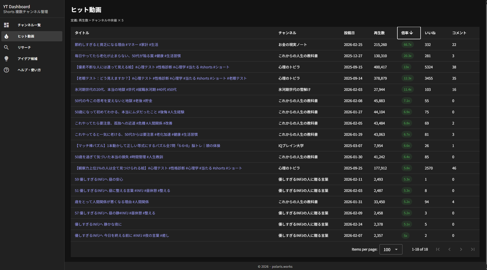
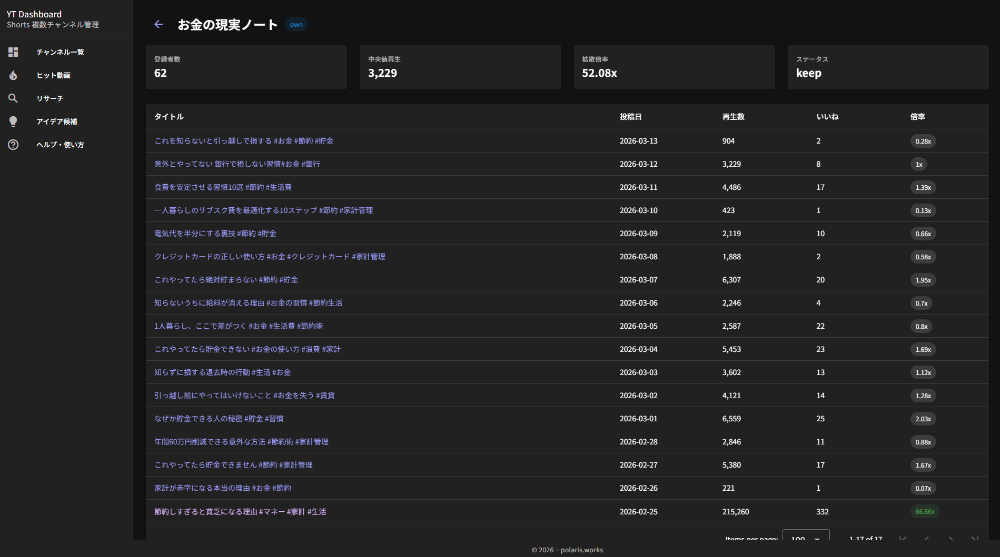
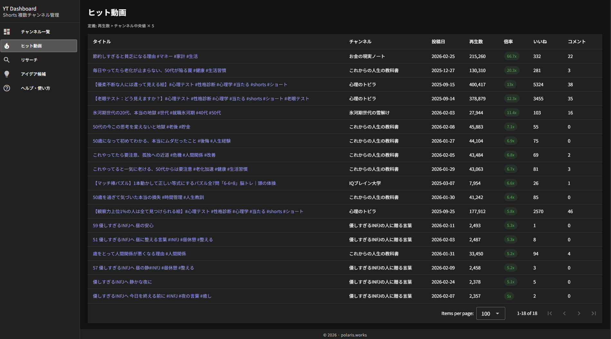

# YouTube Shorts Multi-Channel Dashboard

YouTube Shorts の複数チャンネルを一元管理・分析するローカルツール。

**コンセプト:** YouTube 攻略ツールではなく「テーマ研究ツール」。
投資ポートフォリオのように複数テーマ（チャンネル）を管理し、弱いテーマを切り、強いテーマを伸ばす。

---

## スクリーンショット

**チャンネル一覧（Channel Overview）**


**チャンネル詳細（Channel Detail）**


**ヒット動画（Hit Videos）**


---

## 何ができるか

| 機能 | 内容 |
|------|------|
| **チャンネル一覧** | 全チャンネルを中央値再生・拡散倍率で比較。撤退候補を自動フラグ |
| **ヒット動画分析** | チャンネル中央値×5を超えた動画を抽出。再現できるフォーマットを研究 |
| **チャンネル詳細** | 成長チャート・再生分布・動画一覧を確認 |
| **競合リサーチ** | 研究用チャンネルの強さ・タイトルパターンを分析 |
| **アイデア管理** | リサーチから生まれた新チャンネルアイデアをメモ |

---

## 必要なもの

| ツール | バージョン | 用途 |
|--------|-----------|------|
| Node.js | 18以上 | バックエンド・フロントエンド実行 |
| yt-dlp | 最新版 | 動画リスト収集（quota節約のため主力） |
| YouTube Data API v3 キー | — | チャンネル統計・動画統計の取得 |

### yt-dlp のインストール

```bash
# Ubuntu / Debian
sudo curl -L https://github.com/yt-dlp/yt-dlp/releases/latest/download/yt-dlp -o /usr/local/bin/yt-dlp
sudo chmod a+rx /usr/local/bin/yt-dlp

# macOS (Homebrew)
brew install yt-dlp
```

### YouTube Data API v3 キーの取得

1. [Google Cloud Console](https://console.cloud.google.com/) でプロジェクトを作成
2. 「YouTube Data API v3」を有効化
3. 「認証情報」→「APIキーを作成」

> API quota は 10,000 units/日。動画リスト収集は yt-dlp が主力なので、通常の運用では quota 不足になりにくい設計です。

---

## セットアップ

```bash
# 1. リポジトリをクローン
git clone https://github.com/n-yoshida-polaris/youtube-short-dashboard.git
cd youtube-short-dashboard

# 2. 依存パッケージのインストール
npm install
cd backend && npm install && cd ..
cd frontend && npm install && cd ..

# 3. 環境変数を設定
cp backend/.env.example backend/.env
cp frontend/.env.example frontend/.env
```

`backend/.env` を編集：

```ini
YOUTUBE_API_KEY=your_api_key_here
PORT=3000
```

`frontend/.env` を編集（任意）：

```ini
PORT=5173  # フロントエンドの開発サーバーポート
```

---

## 起動

### ローカル開発

```bash
# バックエンド + フロントエンドを同時起動
npm run dev
```

| サーバー | URL |
|---------|-----|
| Backend API | http://localhost:3000 |
| Frontend | http://localhost:5173 |

### 本番（Ubuntu + nginx）

**1. `.env` を設定**

```ini
# frontend/.env
VITE_API_URL=https://api.example.com  # nginx で公開するバックエンドのURL
```

**2. ビルド**

```bash
npm run build
# → backend/dist/  （Node.js サーバー）
# → frontend/dist/ （静的ファイル）
```

**3. バックエンドを PM2 で常駐化**

```bash
npm install -g pm2
pm2 start backend/dist/server.js --name yt-dashboard
pm2 save
pm2 startup  # OS 再起動後も自動起動
```

PM2 の主要コマンド：

```bash
pm2 list                    # 起動中のプロセス一覧
pm2 logs yt-dashboard       # ログ確認
pm2 restart yt-dashboard    # 再起動
pm2 stop yt-dashboard       # 停止
```

**4. nginx 設定例**

```nginx
# フロントエンド（静的ファイル配信）
server {
    server_name app.example.com;
    root /path/to/youtube-dashboard/frontend/dist;
    index index.html;
    location / {
        try_files $uri $uri/ /index.html;
    }
}

# バックエンド API（リバースプロキシ）
server {
    server_name api.example.com;
    location / {
        proxy_pass http://localhost:3000;
    }
}
```

---

## チャンネルの追加

```bash
# 自分のチャンネル（統計の時系列ログを保存）
npm run add-channel -- UCxxxxxxxxxxxxxxxx own

# 競合・研究用チャンネル（最新スナップショットのみ）
npm run add-channel -- UCyyyyyyyyyyyyyy watch
```

チャンネルIDは YouTube チャンネルページの URL から確認できます（`UC` から始まる文字列）。

---

## データ収集

### 手動実行

```bash
npm run collect
```

### cron で自動実行（推奨: 6時間ごと）

```cron
0 */6 * * * cd /path/to/youtube-dashboard && npm run collect >> /var/log/yt-collect.log 2>&1
```

収集処理の内容：
1. チャンネル情報の更新（登録者数など）
2. 最新100本の動画リストを取得（yt-dlp → API フォールバック）
3. 動画統計を取得・保存（own チャンネルのみ履歴蓄積）

---

## 主要指標

### 中央値再生（最重要）

```
最新100本の再生数の中央値
```

テーマの「地力」。バズによる平均値の歪みを排除。チャンネル間比較の主軸。

### 拡散倍率

```
中央値再生 ÷ 登録者数
```

アルゴリズムへの乗り具合。

| 値 | 評価 |
|----|------|
| < 1 | 弱い |
| 1〜3 | 普通 |
| 3〜10 | 強い |
| > 10 | バズ可能 |

### ヒット動画の定義

```
再生数 > チャンネル中央値 × 5
```

### 撤退候補の条件

```
中央値再生 < 2000
AND 拡散倍率 < 2
```

---

## システム構成

```
YouTube API v3 / yt-dlp
        ↓
  Collector (Node.js + TypeScript)   ← cron 6時間ごと
        ↓
      SQLite
        ↓
  Backend API (Express + TypeScript)
        ↓
  Frontend (Vue 3 + Vuetify)
```

### ディレクトリ構造

```
youtube-dashboard/
├── backend/
│   ├── src/
│   │   ├── collector/
│   │   │   ├── channelCollector.ts   # チャンネル情報収集
│   │   │   ├── videoListCollector.ts # 動画リスト収集（yt-dlp主体）
│   │   │   └── statsCollector.ts     # 動画統計収集
│   │   ├── db.ts          # SQLite スキーマ管理
│   │   ├── youtube.ts     # YouTube API クライアント
│   │   ├── collector.ts   # cron エントリーポイント
│   │   └── server.ts      # Express API サーバー
│   ├── db.sqlite          # データベース（.gitignore 済み）
│   └── package.json
├── frontend/
│   ├── src/
│   │   ├── views/         # 各画面コンポーネント
│   │   └── components/
│   └── package.json
├── docs/                  # 設計ドキュメント
└── CLAUDE.md
```

### DBスキーマ

| テーブル | 内容 |
|---------|------|
| `channels` | チャンネル情報・ステータス |
| `videos` | 動画メタデータ |
| `video_stats_history` | 動画統計の時系列履歴（own チャンネルのみ） |
| `ideas` | 新チャンネルアイデアメモ |

---

## チャンネルステータス

| ステータス | 意味 |
|-----------|------|
| `keep` | 継続中 |
| `watch` | 要観察 |
| `prune` | 撤退候補 |
| `archived` | 停止済み |

---

## API エンドポイント

```
GET /channels            # チャンネル一覧
GET /channels/:id        # チャンネル詳細
GET /videos/hits         # ヒット動画一覧
GET /research/channels   # 研究用チャンネル一覧
GET /ideas               # アイデア一覧
```

---

## 技術スタック

| 領域 | 技術 |
|------|------|
| Backend | Node.js / TypeScript / Express |
| Database | SQLite (better-sqlite3) |
| Frontend | Vue 3 / TypeScript / Vuetify |
| データ収集 | yt-dlp + YouTube Data API v3 |

---

## ライセンス

MIT License — 詳細は [LICENSE](./LICENSE) を参照。

## 免責事項

- 本ツールは [YouTube API Services Terms of Service](https://developers.google.com/youtube/terms/api-services-terms-of-service) に従って使用してください。
- yt-dlp の利用は YouTube 利用規約に抵触する可能性があります。自己責任でご利用ください。
- 本ツールの使用によって生じた損害について、作者は一切の責任を負いません。
